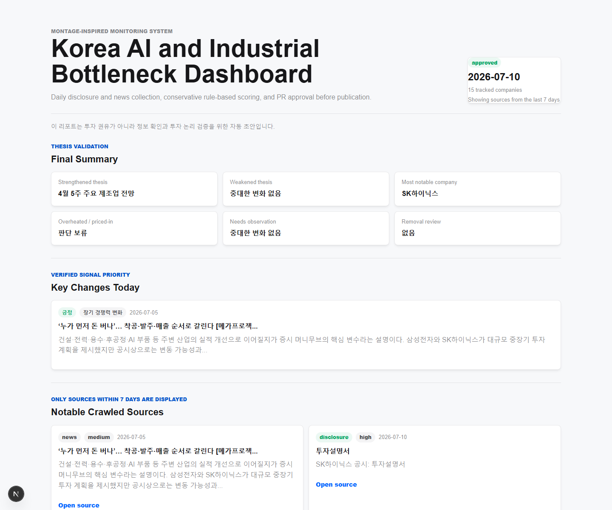

# Korea AI and Industrial Bottleneck Dashboard

한국의 AI·산업 경쟁력을 `AI 반도체 병목`, `전력 인프라 병목`, `제조업과 피지컬 AI` 관점에서 매일 점검하는 투자 논리 검증 대시보드입니다.

공시·뉴스·공개 데이터를 수집하고, 규칙 기반으로 투자 논리의 강화·약화 여부를 보수적으로 판정합니다. 최종 결과는 GitHub PR 승인 흐름을 거쳐 정적 대시보드로 표시됩니다.



## 핵심 기능

- DART 공시와 네이버 뉴스 검색 API 기반 일일 정보 수집
- 규칙 기반 중요도·신뢰도·투자 논리 상태 판정
- 초안 리포트 생성 후 GitHub Pull Request 승인
- 승인된 리포트를 GitHub Pages 정적 대시보드로 표시
- 최신 리포트 기준 7일 이내 정보만 화면에 표시
- DB 없이 JSON 파일과 Git 이력으로 데이터 관리

## 데이터 구조

```text
config/watchlist.json              # 기업, 티커, DART corp code, 투자 축
data/sources/YYYY-MM-DD.json       # 수집된 공시·뉴스 원문 메타데이터
data/drafts/YYYY-MM-DD.json        # 자동 생성 초안 리포트
data/reports/YYYY-MM-DD.json       # 승인된 공개 리포트
```

현재 구조는 별도 DB 없이 리포트 단위 JSON을 축적합니다. Git 이력이 곧 데이터 변경 이력이 되기 때문에, PR 승인 흐름과 잘 맞습니다.

## 수집 방식

수집 스크립트는 `scripts/generate-daily-report.mjs`입니다.

1. `config/watchlist.json`에서 기업 목록을 읽습니다.
2. DART API로 공시를 조회합니다.
3. 네이버 뉴스 검색 API로 기업별 최신 뉴스를 조회합니다.
4. 원문 메타데이터를 `data/sources/`에 저장합니다.
5. 규칙 기반 분석으로 `data/drafts/`에 초안 리포트를 생성합니다.
6. 승인된 리포트는 `data/reports/`에 저장되어 화면에 표시됩니다.

## 분석 로직

핵심 분석 로직은 `src/lib/analysis-rules.mjs`에 있습니다.

- 높은 가중치: 공시, 공급계약, 수주, 실적, 양산, 고객 인증, 증설, 정책 확정
- 낮은 가중치: 반복 홍보, 단순 비전 발표, 기대감 중심 기사
- 신뢰도 낮음: 루머, 수주설, 미확인 표현
- 판단 등급: `강화`, `유지`, `약화`, `판단 보류`
- 관심도 변화: `상향`, `유지`, `하향`, `관찰 필요`

근거가 부족한 경우에는 억지로 결론을 만들지 않고 `판단 보류` 또는 `중대한 변화 없음`으로 표시합니다.

## 디자인 시스템

UI는 [Wanted Lab Montage Web Design System](https://github.com/wanteddev/montage-web)을 참고해 적용했습니다.

Montage의 semantic token 구조를 바탕으로 primary color, neutral surface, status color, subtle border, compact radius, light elevation을 대시보드에 반영했습니다.

## 하네스 설계

에이전트와 자동화 작업의 일관성을 위해 다음 하네스 문서를 포함합니다.

```text
AGENTS.md                         # Codex/agent 작업 규칙
SKILLS.md                         # 데이터 수집·분석·UI·자동화 작업 가이드
.github/copilot-instructions.md   # GitHub Copilot용 repository 지침
.gitattributes                    # 줄바꿈/텍스트 정규화
```

## 자동화 흐름

```text
.github/workflows/daily-report.yml   # 매일 초안 리포트 PR 생성
.github/workflows/pages.yml          # GitHub Pages 정적 배포
```

운영 흐름:

1. `Daily investment report draft` 워크플로가 실행됩니다.
2. 공시·뉴스를 수집해 초안 리포트를 만듭니다.
3. 초안과 승인 파일을 포함한 PR을 생성합니다.
4. PR 검토 후 merge하면 승인 리포트로 반영됩니다.
5. `Deploy dashboard to GitHub Pages`가 정적 페이지를 배포합니다.

## 주의

이 대시보드는 투자 권유가 아닙니다. 자동 분석 결과는 원문 공시·뉴스·실적 자료와 함께 검토해야 하며, 좋은 기업인지와 현재 좋은 가격인지는 분리해서 판단해야 합니다.
